# gVXR Simulation to Dual-Domain CT Reconstruction

End-to-end research code for simulated X-ray computed tomography (CT): generate cone-beam projections from CAD/STL objects with gVXR, reconstruct FDK targets and baselines, train a dual-domain neural reconstruction model, and export predicted 3D volumes as CAD-ready STL/OBJ meshes.

## What This Project Does

The pipeline is designed for sparse-view scientific and industrial CT, where dense scanner access can be expensive or slow. It uses simulation to create paired projection/reconstruction data, then trains a neural model that combines:

- sinogram-domain denoising,
- a differentiable filtered-backprojection (FBP) prior,
- cross-attention between sinogram features and image-domain features,
- image-domain U-Net refinement,
- volume stacking and CAD mesh export.

The current implementation uses FDK reconstructions as offline supervised targets and baselines. During neural inference, the model uses a differentiable FBP layer inside the network as a physics-informed prior, then learns residual correction and sharpening.

## Highlights

- **End to end:** STL mesh to X-ray projections to reconstructed volume to CAD mesh.
- **Sparse-view CT:** evaluates aggressive view reduction at 90, 45, and 30 projection views.
- **Dual-domain learning:** combines sinogram correction, differentiable FBP, attention, and image refinement.
- **Geometry-aware output:** exports reconstructed volumes to STL/OBJ for CAD inspection.
- **Reproducible scripts:** separate commands for simulation, FDK targets, dataset building, training, inference, and mesh export.

## Repository Map

```text
.
|-- DATACREATION/
|   |-- STL/                         # Input CAD/STL objects
|   |-- generate_datasets.py         # Batch gVXR simulation launcher
|   `-- gvxr_projection_script.py    # Per-object cone-beam projection simulation
|-- ct_recon/
|   |-- pure_dl_net.py               # Dual-domain neural CT model
|   |-- reconstruct_fdk_astra.py     # FDK reconstruction utilities
|   |-- sparse_ct_reconstruction.py  # Dataset loading, metrics, helpers
|   |-- data_loader.py               # gVXR output loader
|   |-- geometry.py                  # scanner geometry parsing
|   `-- volume_to_cad.py             # TIF volume to STL/OBJ mesh export
|-- scripts/
|   |-- run_batch_pipeline.py        # FDK target creation + .npz dataset builder
|   |-- data_preparation/
|   |   `-- 01_build_dataset.py      # sparse sinogram to target slice dataset
|   |-- pure_dl/
|   |   |-- 02_train_pure_dl.py      # model training
|   |   `-- 03_inference.py          # volume inference + CAD export
|   `-- classical_reconstruction/
|       `-- reconstruct_fdk.py       # classical baseline entry point
|-- run_full_pipeline.sh             # Linux/macOS end-to-end runner
|-- run_full_pipeline.bat            # Windows end-to-end runner
|-- requirements.txt
`-- Kaggle_Instructions.md
```

Generated files are written mainly under:

```text
data/                         # simulated projection datasets
outputs/batch_datasets/       # training .npz files
outputs/fdk_astra_*/          # FDK target/baseline volumes
outputs/pure_dl_training_*/   # checkpoints and training history
outputs/dl_reconstruction/    # predicted volume, preview, STL, OBJ
```

## Workflow

```mermaid
flowchart LR
    A[CAD/STL objects<br/>DATACREATION/STL] --> B[gVXR cone-beam<br/>projection simulation]
    B --> C[Projection folders<br/>data/*/settings.cto + TIFFs]
    C --> D[FDK/ASTRA reconstruction<br/>offline target + baseline]
    C --> E[Sparse-view sinogram dataset<br/>.npz files]
    D --> E
    E --> F[Dual-domain neural model<br/>Sinogram U-Net + differentiable FBP + attention + Image U-Net]
    F --> G[Predicted 2D slices]
    G --> H[Stacked 3D volume<br/>TIF]
    H --> I[CAD export<br/>Otsu + marching cubes + smoothing]
    I --> J[STL / OBJ mesh]
```



## Architecture

The core model is `PureDLPipeline` in `ct_recon/pure_dl_net.py`. Despite the historical file/class name, the current architecture is best described as a **dual-domain physics-informed neural CT reconstruction model**.

### Stage 1: SinogramUNet

Input: sparse/noisy sinogram tensor.

Purpose:

- cleans sensor-domain noise,
- preserves the original sinogram through a residual skip connection,
- produces a corrected sinogram for reconstruction.

### Stage 2: DomainTransformNet

Input: corrected sinogram.

Purpose:

- computes a differentiable FBP prior with PyTorch operations,
- encodes the prior in the image domain,
- extracts compact sinogram features,
- injects sinogram evidence into image features using cross-attention,
- applies dilated convolution and squeeze-and-excitation refinement,
- predicts a rough reconstructed slice with a residual connection from the FBP prior.

### Stage 3: ImageUNet

Input: rough reconstructed image.

Purpose:

- refines image-domain artifacts,
- sharpens material boundaries,
- outputs the final normalized CT slice.

Training uses the weighted multi-objective loss implemented in `scripts/pure_dl/02_train_pure_dl.py`:

```text
0.1 * sinogram loss
+ 0.2 * rough image loss
+ 0.4 * final image loss
+ 0.3 * Sobel edge loss
```

## Installation

The project expects Python 3.10+ and a working scientific Python/GPU environment. CUDA is recommended for training, but many preprocessing steps can run on CPU.

```bash
# after cloning this repository
cd gVXRsimulation_PureDLReconstruction_Pipeline
python -m venv .venv
source .venv/bin/activate
python -m pip install --upgrade pip
python -m pip install -r requirements.txt
```

If you use conda, a typical environment is:

```bash
conda create -n ct_pipeline python=3.10
conda activate ct_pipeline
pip install -r requirements.txt
```

Notes:

- `gvxrPython3` requires OpenGL support. On headless servers, you may need EGL/virtual display configuration.
- `astra-toolbox` installation is platform-dependent; conda often works best for CUDA-enabled ASTRA.
- For CAD export, `trimesh` and `scikit-image` are required.

## Quick Start

For the default end-to-end run on Linux/macOS:

```bash
bash run_full_pipeline.sh
```

This performs:

1. gVXR projection simulation for all STL files in `DATACREATION/STL/`.
2. FDK target/baseline reconstruction.
3. `.npz` dataset construction.
4. neural model training.
5. inference on one sample.
6. 3D volume and STL/OBJ export.

On Windows:

```bat
run_full_pipeline.bat
```

## Reproduce Step By Step

### 1. Generate simulated projection data

```bash
python DATACREATION/generate_datasets.py
```

This scans `DATACREATION/STL/` and creates simulated cone-beam CT projection datasets under `data/`. Each valid dataset contains a `settings.cto` file and TIFF projection images.

Default simulation settings are configured in `DATACREATION/generate_datasets.py` and `DATACREATION/gvxr_projection_script.py`. The current batch uses titanium-like material settings with photon and Gaussian noise parameters.

### 2. Build FDK targets and training datasets

```bash
python scripts/run_batch_pipeline.py
```

This scans `data/`, reconstructs FDK volumes when needed, and builds sparse-sinogram training files:

```text
outputs/fdk_astra_<dataset_name>/fdk_volume.tif
outputs/batch_datasets/<dataset_name>.npz
```

Useful options:

```bash
python scripts/run_batch_pipeline.py --sparse-step 4 --downsample 2
```

- `--sparse-step 1`: use all simulated projection views.
- `--sparse-step 4`: keep every fourth view for sparse-view training.
- `--downsample 2`: spatially downsample detector rows/columns to reduce memory.

### 3. Train the neural reconstruction model

```bash
python scripts/pure_dl/02_train_pure_dl.py \
  --dataset-path outputs/batch_datasets \
  --epochs 20 \
  --batch-size 4 \
  --learning-rate 1e-3 \
  --val-fraction 0.2 \
  --seed 0
```

Outputs:

```text
outputs/pure_dl_training_centered/best_model_centered.pt
outputs/pure_dl_training_centered/last_model_centered.pt
outputs/pure_dl_training_centered/training_history.json
```

Resume training:

```bash
python scripts/pure_dl/02_train_pure_dl.py \
  --dataset-path outputs/batch_datasets \
  --resume-checkpoint outputs/pure_dl_training_centered/best_model_centered.pt \
  --learning-rate 1e-4
```

### 4. Run inference and export CAD meshes

Choose a generated sample folder containing `settings.cto`, then run:

```bash
python scripts/pure_dl/03_inference.py \
  --model-path outputs/pure_dl_training_centered/best_model_centered.pt \
  --sample-dir data/<sample_name> \
  --output-path outputs/dl_reconstruction/dl_volume.tif \
  --batch-size 8
```

Outputs:

```text
outputs/dl_reconstruction/dl_volume.tif
outputs/dl_reconstruction/dl_volume_preview.png
outputs/dl_reconstruction/dl_volume.stl
outputs/dl_reconstruction/dl_volume.obj
```

The CAD export path uses thresholding, marching cubes, smoothing, optional decimation, and mesh repair routines from `ct_recon/volume_to_cad.py`.

## Example Results

At the most aggressive 30-view setting, the neural model improves SSIM over sparse-view FDK across the evaluated object families:

| Object | FDK SSIM | DL SSIM | Relative SSIM gain | FDK PSNR | DL PSNR |
| --- | ---: | ---: | ---: | ---: | ---: |
| Lizard | 0.2513 | 0.5834 | 132.2% | 22.90 | 14.80 |
| Void pipe | 0.5041 | 0.8857 | 75.7% | 28.30 | 31.57 |
| Torus | 0.2926 | 0.4139 | 41.4% | 23.55 | 13.39 |
| Void sphere | 0.2353 | 0.4659 | 98.0% | 21.55 | 23.81 |

The PSNR/SSIM split is important: FDK can remain competitive by pixel error, while the learned model is often stronger by structural similarity under severe undersampling.

Typical output artifacts after inference:

```text
outputs/dl_reconstruction/dl_volume.tif
outputs/dl_reconstruction/dl_volume_preview.png
outputs/dl_reconstruction/dl_volume.stl
outputs/dl_reconstruction/dl_volume.obj
```

## Expected Inputs

Place STL meshes here:

```text
DATACREATION/STL/
```

The repository already contains example STL objects such as:

```text
lizard.stl
torus.stl
void_pipe.stl
void_sphere.stl
void_cube.stl
void_defected_box.stl
```

To add your own object, copy an `.stl` file into `DATACREATION/STL/` and rerun the generation and batch pipeline.

## Common Reproduction Checks

If the pipeline fails, check these first:

- `data/<sample_name>/settings.cto` exists after simulation.
- `outputs/fdk_astra_<sample_name>/fdk_volume.tif` exists after FDK reconstruction.
- `outputs/batch_datasets/*.npz` exists before training.
- the checkpoint path passed to inference exists.
- the checkpoint metadata matches the dataset geometry and image size.
- OpenGL is available for gVXR.
- CUDA/ASTRA versions are compatible if using GPU FDK.

## Useful Commands

Run a model shape/VRAM sanity check:

```bash
python ct_recon/pure_dl_net.py
```

Build datasets from existing projection folders only:

```bash
python scripts/run_batch_pipeline.py --sparse-step 4 --downsample 2
```

Prepare sequential training over STL files:

```bash
python scripts/sequential_train_pipeline.py --epochs 8 --batch-size 2
```

Quick sequential test:

```bash
python scripts/sequential_train_pipeline.py --quick-test
```

## Method Summary

The method intentionally keeps both analytic and learned components:

- FDK/ASTRA reconstruction is used offline to create supervised targets and baselines.
- Differentiable FBP is used inside the network as a geometric prior.
- Attention and U-Net modules learn sparse-view correction and image refinement.
- CAD export evaluates whether slice-level reconstructions remain useful as geometry.

This makes the project useful for studying CT reconstruction quality at both image and mesh levels.

## Limitations

- Current experiments are simulation-based.
- FDK-derived targets can transfer target-side bias into training.
- Slice-wise inference does not explicitly enforce 3D consistency.
- The object/material dataset is modest compared with real industrial CT diversity.
- Real scanner effects such as scatter, beam hardening, detector drift, and calibration error require additional validation.

## Citation

If you use this repository, cite the repository and relevant dependencies such as gVXR, ASTRA, FDK, SSIM, and marching cubes where applicable.

```bibtex
@misc{gvxr_dualdomain_ct_2026,
  title = {Dual-Domain Neural CT Reconstruction from X-Ray Simulation to CAD-Ready Geometry},
  author = {Kumar, Pushkar and collaborators},
  year = {2026},
  note = {Research code for simulated sparse-view CT reconstruction and CAD export}
}
```
